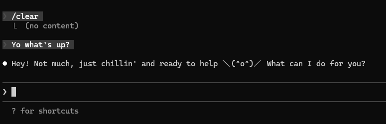

<div align="center">
  
</div>

kaomoji-ai teaches your AI coding assistant to use kaomoji instead of standard emojis. No plugins, no config, just one command and your assistant will naturally reach for `＼(^o^)／` instead of 🎉.

Supports **Claude Code** and **Codex CLI**.

## Getting started

1. Run the install script
    ```bash
    curl -fsSL https://raw.githubusercontent.com/7PH/kaomoji-ai/master/install.sh | sh
    ```

2. That's it! Restart your editor and your AI assistant will use kaomoji in all sessions.

## What it does

Detects which AI coding assistants are installed and appends a kaomoji preference block to each one's global instructions file:

| Tool | File |
|------|------|
| Claude Code | `~/.claude/CLAUDE.md` |
| Codex CLI | `~/.codex/AGENTS.md` (or `$CODEX_HOME/AGENTS.md`) |

## Uninstall

Run the uninstall script:
```bash
curl -fsSL https://raw.githubusercontent.com/7PH/kaomoji-ai/master/uninstall.sh | sh
```

## Contributing

Having trouble? Found a bug? Want to add more kaomoji? Any kind of contribution is welcome — open an issue or create a pull request.
